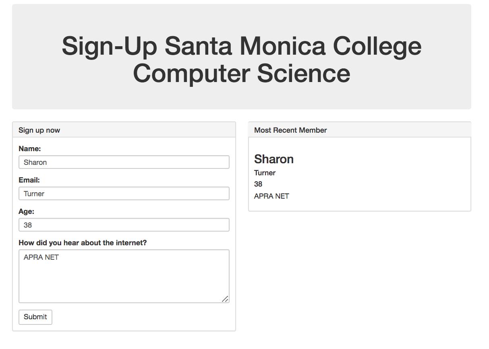

# Sign Up


Simple Sign up is a web form that uses browser local storage. Then using jQuery the local storage is read and displayed on screen.

Go to the live link below: 
https://flintsable.github.io/SignUp/

Simple Sign up is a web form that uses browser local storage. Then using jQuery the local storage is read and displayed on screen. 


```
$("#name-display").html(localStorage.getItem("name"));
$("#email-display").html(localStorage.getItem("email"));
$("#age-display").html(localStorage.getItem("age"));
$("#comment-display").html(localStorage.getItem("comment"));

```


